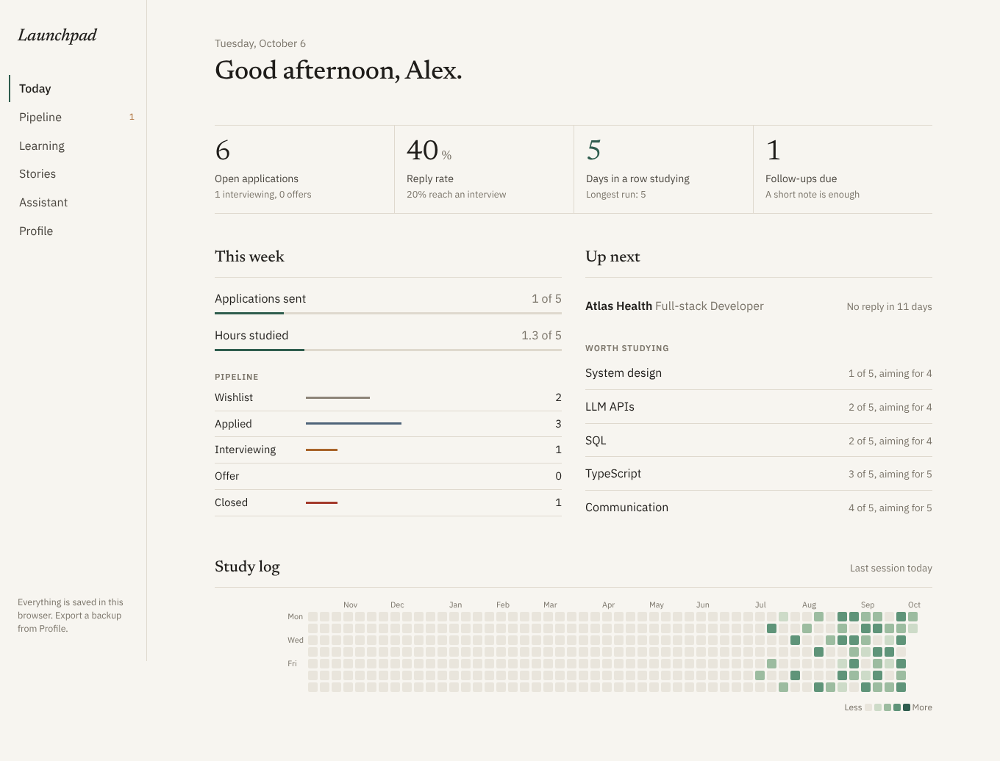
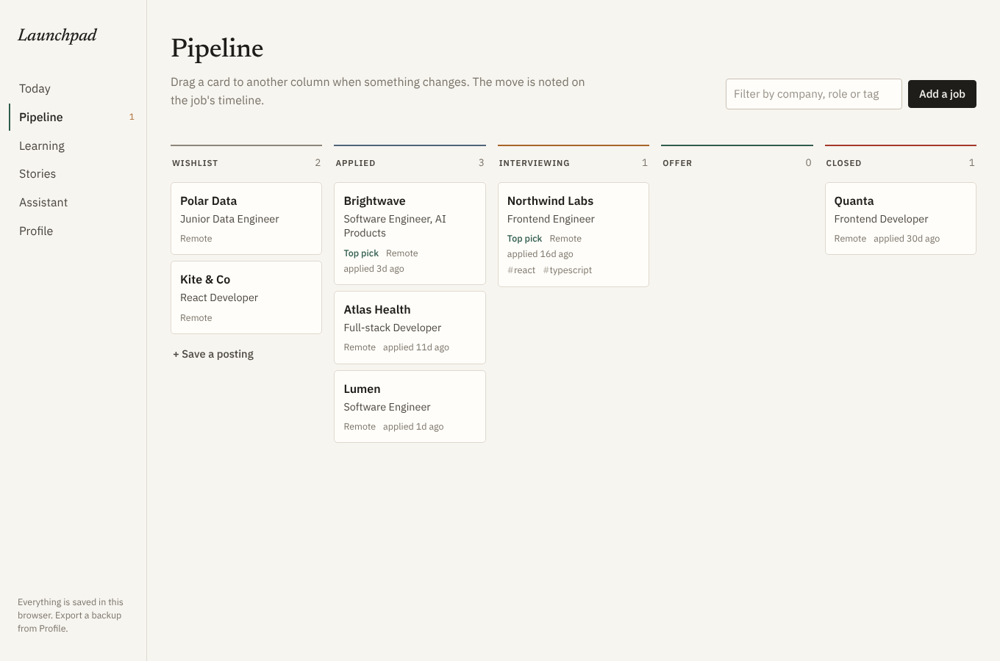
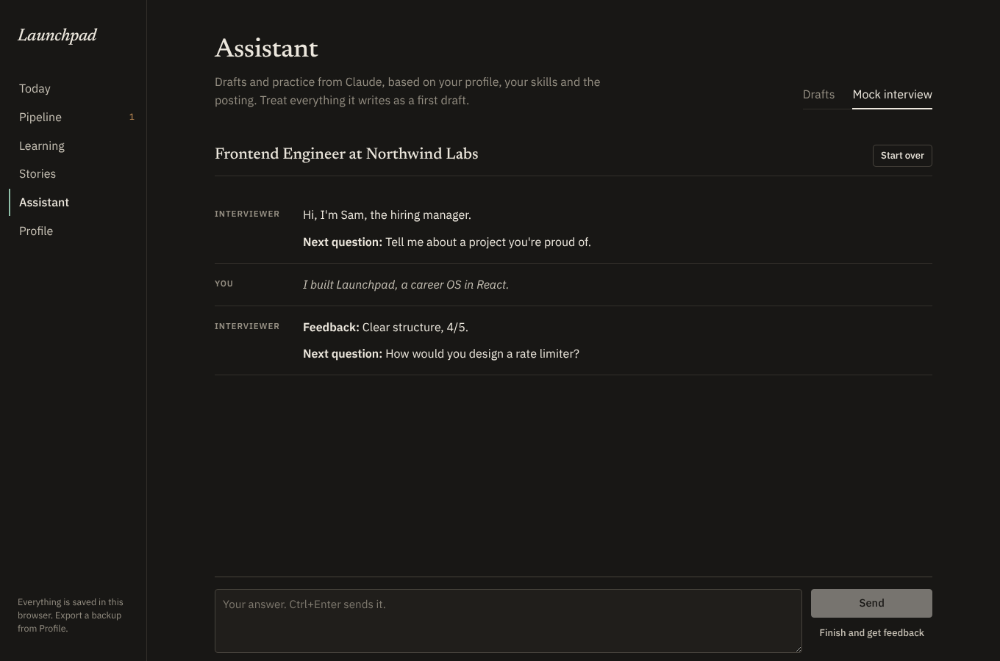

# Launchpad

A small web app for running a job search: applications, study time, interview stories, and an assistant that drafts tailored material from your own profile.

I wanted one place for the whole process instead of a spreadsheet, a notes app and a pile of browser tabs. It runs entirely in the browser and keeps data in local storage, so there's no account and no server.



## Features

- **Today.** Open applications, reply rate, follow-ups that are due, this week's goals, and a year of study sessions on a calendar grid.
- **Pipeline.** A board from wishlist to offer. Dragging a card records the change on the job's timeline. Jobs with no reply after a week are flagged for a follow-up, and pasting the posting shows which of your skills it mentions.
- **Learning.** Skills with a current and a target level, a session log, and a streak.
- **Stories.** Behavioral interview stories in situation / task / action / result form, with an overview of which themes are covered.
- **Assistant.** Uses the Claude API with your own key. It can check how well you fit a posting, rewrite resume bullets, draft a cover letter or an outreach note, put together a four-week study plan, give feedback on a story, and run a mock interview for a specific job.
- **Backups.** Export and import everything as JSON (the API key is never included).





## Running it

```bash
npm install
npm run dev
```

Then open http://localhost:5173. "Look around with sample data" on the first screen fills the app with example data.

The assistant needs an Anthropic API key, which you can create at [console.anthropic.com](https://console.anthropic.com) and paste on the Profile page. It's kept in local storage on your machine only.

Other scripts:

```bash
npm test          # unit tests (Vitest)
npm run check     # lint, typecheck and tests
npm run build     # production build in dist/
```

## How it's built

React 19 and TypeScript on Vite, without a component library.

- All state changes go through one reducer (`src/lib/reducer.ts`), and the whole state is saved as a single versioned JSON document (`src/lib/storage.ts`).
- Stats, streaks, follow-up rules and the calendar grid are plain functions in `src/lib/analytics.ts` and are unit-tested.
- Assistant replies stream in through the official Anthropic SDK (`src/lib/ai.ts`). Prompts live in `src/lib/prompts.ts`.
- Replies are rendered with a small Markdown parser (`src/lib/markdown.ts`) that builds React elements directly instead of injecting HTML.
- The assistant page is lazy-loaded, so the SDK is only downloaded when you open it.
- Typography uses Newsreader and IBM Plex, self-hosted through Fontsource.

CI runs lint, typecheck, tests and a build on every push. Pushes to `main` are deployed to GitHub Pages; to enable that, set **Settings → Pages → Source** to **GitHub Actions** once.

## Roadmap

- Contacts, linked to jobs
- A weekly review page
- Structured fit scores saved on each job, so the board can be sorted by fit
- Importing a job from its URL, and the profile from a resume PDF
- IndexedDB instead of local storage
- A small backend so the API key doesn't have to live in the browser
- Sync between devices

## License

MIT
